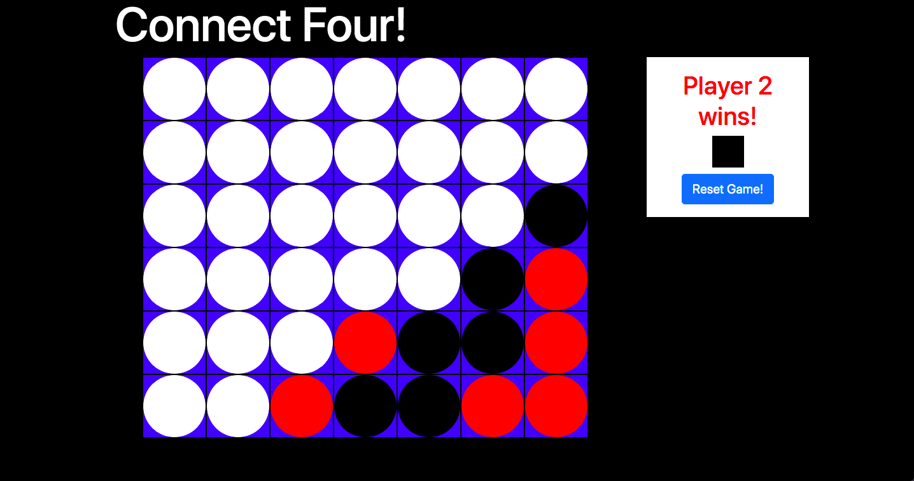

This is a Connect Four game built with Vanilla JavaScript, HTML, CSS, jQuery, and Browserify. Two players will be able to use this game.

A version of this game built in React. You can find it [here](https://github.com/Brandoncyu/connect4-react).

## Getting Started

The game is complete, so all you will need to do is click the "index.html" file to open up the game. 

If you would like to get you a copy of the project up and running on your local machine for development and testing purposes. 

### Prerequisites

What things you need to install the software and how to install them

* fork and clone this repository

### Installing

Install the Node dependencies:

```shell
run npm install
```

Run browserify to compile your code into a bundle

```shell
run npm build
```

Run Watchify and Live-Server simultaneously using the npm command below. Whenever you make an edit to your scripts, Watchify will re-compile your bundle with your new code. Live-Server will refresh your browser and fetches your new HTML, CSS and JavaScript files.

```shell
run npm dev
```

## Key Features

When the game begins, you will be presented with a board that is empty. The player number and color will be on the status bar on the right.


Click the column you want to put your first piece in. It will then populate in the lowest row. The status bar will then toggle to the next player, who can then make his or her move.


You can keep going until there is a winner. You can win by having four or more in a row horizontally, vertically, or diagnoally. When it happens, the status bar will update on the right, denoting the winner. You will not be able to make any more moves on the board.


If you fill up an entire column, you can still click on the same column, but you will not be able to fill it up anymore. The player will not toggle to the next one.


When the game is over, you can hit the "Reset Game!" button on the status bar. This will empty out the board and start with the first player once again. You can also do this mid-game as well.

## Built With

* [JavaScript](https://www.javascript.com/) - The language
* [Bootstrap](https://bootstrap.com/) - The css framework used
* [jQuery](https://jquery.com/) - A JavaScript library designed to simplify HTML DOM tree traversal and manipulation. 
* [Browserify](http://browserify.org/) - An open-source JavaScript tool that allows developers to write Node.js-style modules that compile for use in the browser. 
* [Watchify](https://github.com/browserify/watchify) - An npm package that watches your broswerify builds. Any update on the source file and your browserify bundle will be recompiled on the spot.
* [Live-Server](https://www.npmjs.com/package/live-server) - An npm package that is a little development server with live reload capability. Used in conjunction with Browserify and Watchify to test file.


## Contributing

Please send me a message for details on our code of conduct, and the process for submitting pull requests.

## Author

* **Brandon Yu** - *Initial work* - [Brandoncyu](https://github.com/Brandoncyu)

## License

This project is licensed under the MIT License - see the [LICENSE.md](LICENSE.md) file for details
